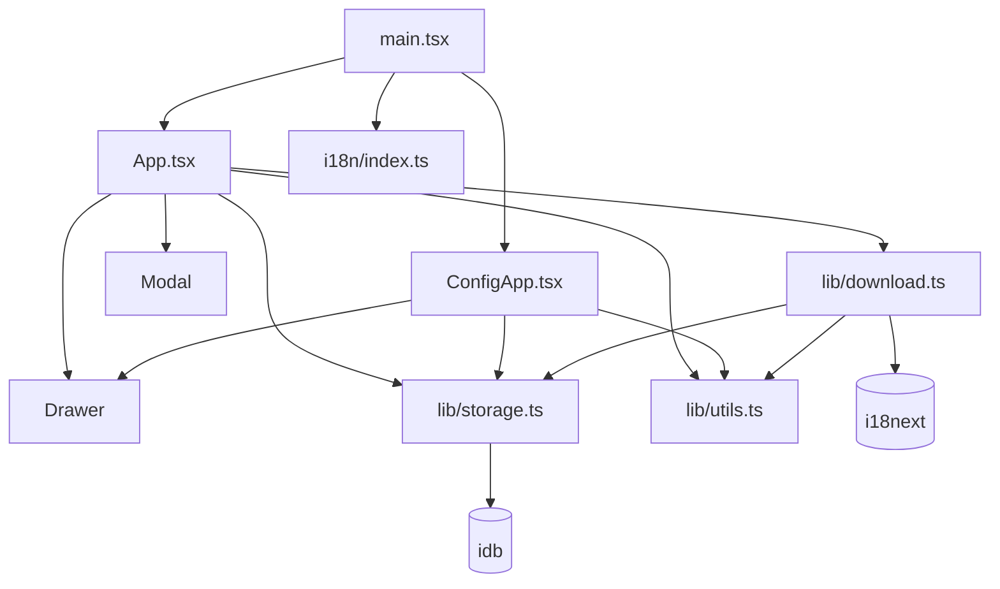
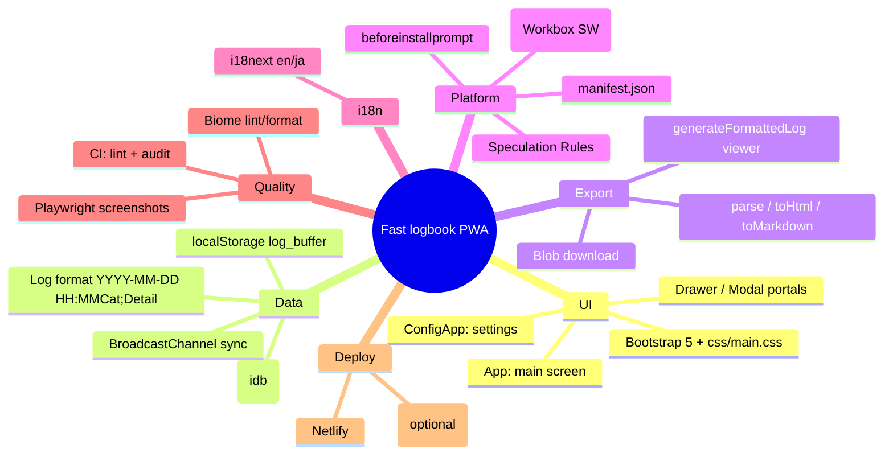

# Components & Application Structure

- [Components \& Application Structure](#components--application-structure)
  - [Directory Layout](#directory-layout)
  - [Module Dependency Graph](#module-dependency-graph)
  - [Namespace / Vendor Conventions](#namespace--vendor-conventions)
  - [Project Mind Map](#project-mind-map)

## Directory Layout

(Factual)

```plain
src/
├── main.tsx           # Entry: router (createHashRouter), StrictMode, global CSS imports
├── App.tsx            # Main screen (log CRUD, shortcuts, export, PWA install)
├── ConfigApp.tsx      # Settings screen
├── globals.d.ts       # BeforeInstallPromptEvent ambient type
├── components/
│   ├── Drawer.tsx     # Portal offcanvas (shared by both screens)
│   └── Modal.tsx      # Portal modal (delete / notice / help)
├── i18n/
│   ├── index.ts       # i18next init, en/ja detection
│   └── locales/{en,ja}.json
└── lib/
    ├── storage.ts     # IndexedDB kv wrapper (idb)
    ├── utils.ts       # Date/time helpers, keys, escapeHtml, theme
    └── download.ts    # parse/toHtml/toMarkdown/generateFormattedLog/download
```

## Module Dependency Graph

One-way, no cycles (Factual):



Note: unlike the old `js/lib/` rule ("lib modules must not depend on each other"), `lib/download.ts` **does** import `lib/storage.ts` and `lib/utils.ts`. The stale rule lives in `.claude/rules/code-style.md` — see [known_bugs.md](known_bugs.md).

## Namespace / Vendor Conventions

- No custom vendor namespace / path aliases; relative imports only (`./lib/utils`).
- Third-party UI vendor is Bootstrap 5 (npm-bundled); its class vocabulary (`btn`, `modal`, `offcanvas`, grid) is the de-facto styling namespace.
- Shared cross-tab channel name: `fast-logbook-sync`; log viewer window name: `_log_viewer`.

## Project Mind Map



d363d07ab70bdbae818bada7838fe13166f4ef08
