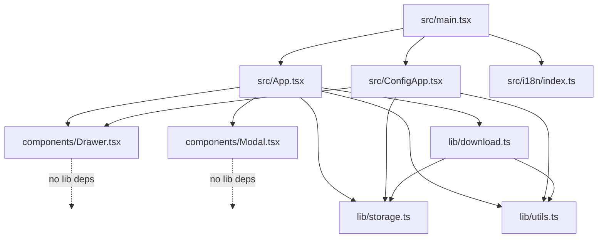

# Components

## Scope note

This document was previously written for the vanilla-JS era (`js/main.js`, `js/config.js`, `js/lib/*`). That codebase no longer exists at HEAD — the project has fully migrated to React 19.2 + TypeScript. This is a full rewrite in plain English.

## File inventory (`src/`)

| File | Lines | Role |
|---|---|---|
| `src/App.tsx` | 973 | Main logbook screen — top-level page component, largest file in `src/` |
| `src/lib/download.ts` | 249 | Log formatting/export logic (HTML generation, file download) |
| `src/ConfigApp.tsx` | 225 | Settings screen — top-level page component |
| `src/lib/utils.ts` | 170 | Pure helper functions (time parsing, theming, PWA install prompt helpers, storage key constants) |
| `src/components/Modal.tsx` | 86 | Shared modal dialog, portal-based |
| `src/components/Drawer.tsx` | 72 | Shared slide-out drawer, portal-based |
| `src/lib/storage.ts` | 57 | IndexedDB-backed key/value storage wrapper (via `idb`), plus localStorage migration helper |
| `src/i18n/index.ts` | 25 | i18next initialization, wires in `en.json`/`ja.json` |
| `src/main.tsx` | 21 | Entry point — mounts React root, sets up `react-router-dom` hash router for `App`/`ConfigApp` |
| `src/globals.d.ts` | 4 | Ambient TS interface for `BeforeInstallPromptEvent` (not a DOM built-in) |
| `src/i18n/locales/en.json`, `ja.json` | — | Translation strings (not analyzed here; content, not structure) |

Total `src/*.ts(x)` (excluding JSON locale files): 1,882 lines.

## Dependency diagram

```mermaid
graph TD
  main[src/main.tsx] --> App[src/App.tsx]
  main --> ConfigApp[src/ConfigApp.tsx]
  main --> i18nIndex[src/i18n/index.ts]

  App --> Drawer[components/Drawer.tsx]
  App --> Modal[components/Modal.tsx]
  App --> download[lib/download.ts]
  App --> storage[lib/storage.ts]
  App --> utils[lib/utils.ts]

  ConfigApp --> Drawer
  ConfigApp --> storage
  ConfigApp --> utils

  download --> storage
  download --> utils

  Drawer -.no lib deps.-> none1[ ]
  Modal -.no lib deps.-> none2[ ]

  style none1 fill:none,stroke:none
  style none2 fill:none,stroke:none
```

## Verification of prior finding: `lib/` one-way dependency claim

**Confirmed false as a strict "lib files never depend on each other" rule.** `src/lib/download.ts` imports from both `./storage` (`getItem`) and `./utils` (`escapeHtml`, `fetchHourFromTime`, `fetchMinFromTime`, `getTodayString`, `LOG_DATA_KEY`, `ROUNDING_UNIT_MINUTE_KEY`) — verified directly at lines 1–10 of `src/lib/download.ts`.

The actual shape is a shallow DAG, not a flat independent set: `storage.ts` and `utils.ts` have no imports from other `lib/` files (leaf nodes), while `download.ts` sits above both and depends on them. So the convention holds as "no cycles, and leaf utilities don't import each other," but not as "no file in `lib/` imports another file in `lib/`." The project's own `.claude/rules/code-style.md` states "Modules inside `js/lib/` must not depend on each other (one-way dependency only)" — this refers to the old vanilla-JS `js/lib/`, which no longer exists; that rule's applicability to the current `src/lib/` (TS) directory is Unconfirmed/likely stale, since `download.ts → storage.ts` + `download.ts → utils.ts` is exactly the pattern that rule would forbid if applied literally.

## Custom vendor namespace

**None found.** Searched for `window.*` assignments, `globalThis.*` assignments, `declare global`, and custom `namespace` blocks across `src/`.

- `src/globals.d.ts` only declares an ambient **interface** (`BeforeInstallPromptEvent`) used for typing the non-standard `beforeinstallprompt` DOM event — it does not extend `Window` or attach anything to a global namespace.
- All `window.*` usages found (`App.tsx:235,241,250,384`; `lib/utils.ts:132,159`; `lib/download.ts:35,38`) are standard DOM API calls (`addEventListener`, `dispatchEvent`, `location.reload`, `open`, `matchMedia`) — reads/calls on the existing global, not a custom static namespace like the old vanilla-JS `Multilingualization` class.
- No evidence of a custom vendor/utility namespace pattern in this codebase at HEAD. (This differs from the prior vanilla-JS docs, which described a `Multilingualization` static class — that class and its file no longer exist.)

## App.tsx size — is 973 lines (~33KB) worth splitting?

**Facts:** `App.tsx` holds routing-level state (10+ `useState` hooks observed), effect wiring for `beforeinstallprompt`/`appinstalled`/theme, date-boundary calculation, and orchestrates `Drawer`, `Modal`, `download.ts`, and `storage.ts`. It is roughly 4x the size of the next-largest file (`download.ts`, 249 lines) and well over this project's own stated guideline of "200-400 lines typical, 800 max" for file size (per user's global coding-style rule).

**Options:**

1. **Leave as-is.** ⭐️⭐️ — Works today, but already exceeds the project's own 800-line ceiling; each future feature addition compounds review difficulty and merge-conflict risk in a single-page-app's most central file.
2. **Extract custom hooks** (e.g. `useInstallPrompt`, `useTheme`, `useLogEntries`) out of `App.tsx`, keeping `App.tsx` as a thin composition/JSX layer. ⭐️⭐️⭐️⭐️ — Idiomatic React refactor, low risk (pure extraction, no behavior change), directly addresses the state/effect bulk that likely accounts for much of the 973 lines. Speculative: exact hook boundaries need a line-by-line read of `App.tsx`, which was out of scope for this structural pass.
3. **Split into multiple presentational sub-components** (e.g. separate the log-entry table/list rendering from the toolbar/controls). ⭐️⭐️⭐️ — Also valid, complements option 2, but sub-component boundaries are speculative without a deeper read of the JSX.

**Recommendation:** Option 2 (custom-hook extraction) first, since state/effects are the more mechanical and lower-risk win; consider option 3 afterward if the JSX portion remains large. This assessment is based on line count and import surface only — a line-by-line read of `App.tsx`'s internals (its ~973 lines) was not performed as part of this pass and would be needed to size the effort precisely.

<!-- commit-hash: e021877bb892db6cc019f4e0520449119de3c079 -->
