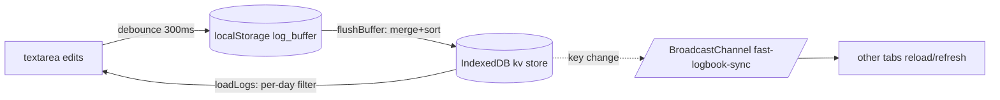

# Databases (Client-side Storage)

- [Architecture](#architecture)
- [Connection Information](#connection-information)
- [Schema / Key Inventory](#schema--key-inventory)
- [Migration](#migration)
- [Domain Summary](#domain-summary)

## Architecture

No server database. All persistence is in-browser (Factual):

- **IndexedDB** — canonical store. DB `fast-logbook-pwa` v1, single object store `kv` (plain key-value, out-of-line string keys/values). Accessed only through [src/lib/storage.ts](../../src/lib/storage.ts) (`getItem`/`setItem`/`removeItem`, via `idb`).
- **localStorage** — transient write buffer for the active day's textarea (`log_buffer`, `log_buffer_date`), debounce-written (300ms) and merged into IndexedDB by `flushBuffer()` in [src/App.tsx](../../src/App.tsx) on tab-hide / date change / load / BroadcastChannel message.
- **BroadcastChannel** `fast-logbook-sync` — cross-tab change notification (`{key, value}` messages).

## Connection Information

| Item | Value |
| --- | --- |
| DB name | `fast-logbook-pwa` |
| Version | 1 |
| Object store | `kv` (no keyPath, no indexes) |
| Access layer | `src/lib/storage.ts` (module-level `dbPromise`) |

## Schema / Key Inventory

All values are strings. (Factual, from `App.tsx` / `ConfigApp.tsx` / `utils.ts`)

| Key | Store | Content |
| --- | --- | --- |
| `log` (`LOG_DATA_KEY`) | IndexedDB | Full raw log text, lines `YYYY-MM-DD HH:MMCategory;Detail` |
| `rounding_mins` (`ROUNDING_UNIT_MINUTE_KEY`) | IndexedDB | Rounding unit: 1/5/10/15/30/60 |
| `date-roll-over-time` | IndexedDB | Day boundary time, default `05:00` |
| `shortcut_1` … `shortcut_9` | IndexedDB | Shortcut tag strings |
| `last_edited_date` | IndexedDB | Last selected date `YYYY-MM-DD` |
| `migration_version` | IndexedDB | Migration counter (currently `1`) |
| `notice_date_selector` | IndexedDB | One-time feature-notice flag |
| `log_buffer` / `log_buffer_date` | localStorage | Unflushed active-day edits |

## Migration

`runMigrations()` in `App.tsx` — version-gated (`migration_version` < 1):
1. `migrateFromLocalStorage()` copies legacy localStorage keys (log, rounding, roll-over, shortcuts 1-9) into IndexedDB, deleting originals.
2. Legacy keys `date-roll-over-time-value`, `downloadUrl`, `downloadFilename` cleaned up.
3. Sets `migration_version = '1'`.

## Domain Summary

Single domain: **work-time logging**. One text blob is the whole dataset; "tables" are emulated by line format + key-value settings. No relations, no server sync (multi-device sync is an open TODO, see [todo.md](todo.md)).

d363d07ab70bdbae818bada7838fe13166f4ef08
