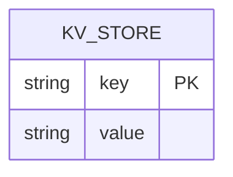
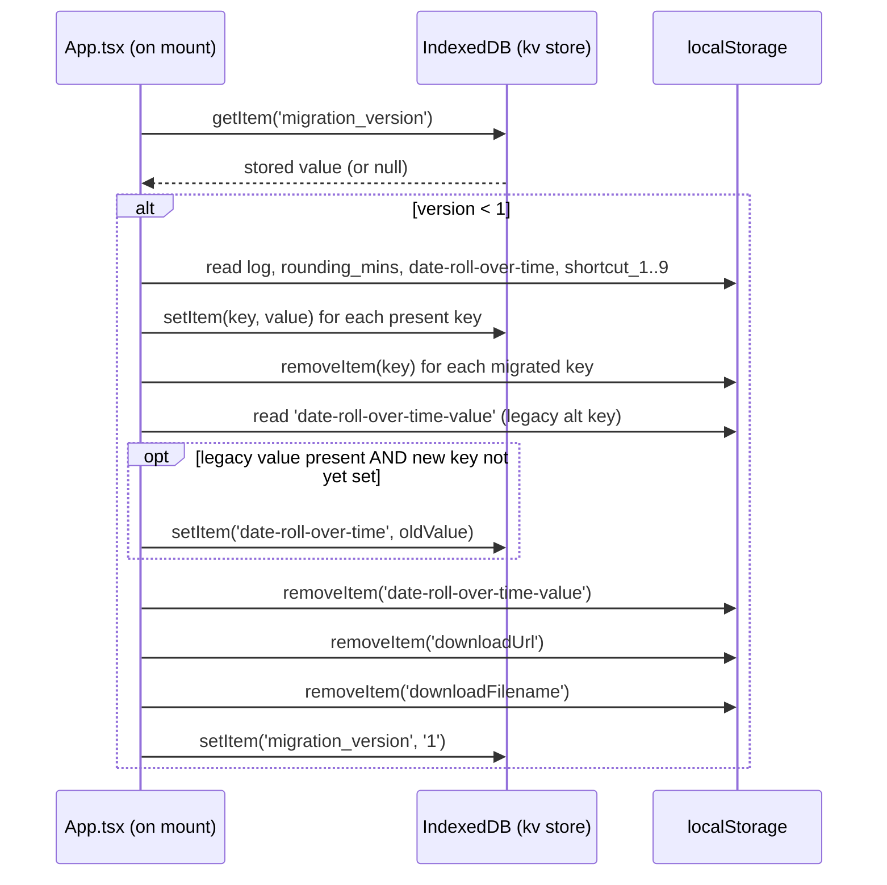
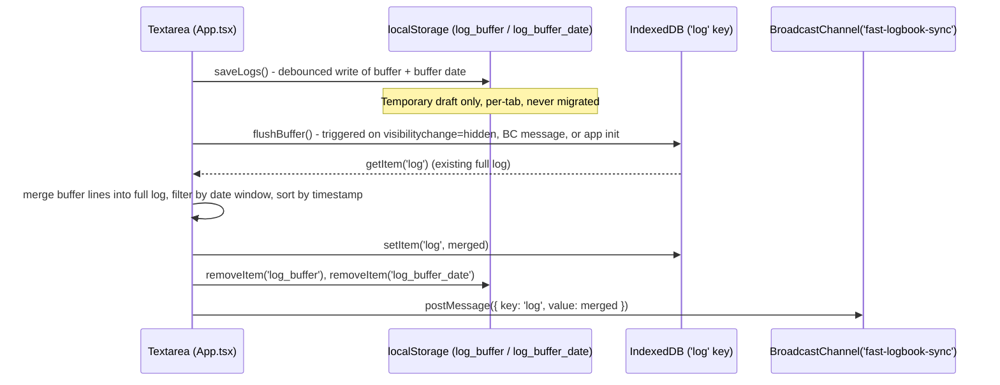

# Databases

This is a backend-less, client-only PWA. There is no server, no SQL/NoSQL database, and no network-based persistence. All state lives in the browser, split across two mechanisms:

- **IndexedDB** (via the `idb` wrapper library) — the primary, durable store for all app data.
- **`localStorage`** — used only as a transient, per-tab edit buffer (`log_buffer` / `log_buffer_date`) that is never migrated and is flushed into IndexedDB on every save.

There is no connection string, host, port, or credential — IndexedDB is opened directly in the browser origin.

## IndexedDB structure

Source: `src/lib/storage.ts`.

- DB name: `fast-logbook-pwa`
- DB version: `1`
- Object store: `kv` (single flat key-value store, no indexes, no keyPath — keys are passed explicitly to `get`/`put`/`delete`)
- Values are always stored as strings (numbers and booleans are serialized to string by callers, e.g. `String(n)`).

API surface (`src/lib/storage.ts`):

| Function | Signature | Behavior |
|---|---|---|
| `getItem` | `(key: string) => Promise<string \| null>` | Returns the stored string, or `null` if absent |
| `setItem` | `(key: string, value: string) => Promise<void>` | Upserts a value under `key` |
| `removeItem` | `(key: string) => Promise<void>` | Deletes the entry for `key` |
| `migrateFromLocalStorage` | `(keys: string[]) => Promise<void>` | For each key, if present in `localStorage` (and not the literal string `'undefined'`), copies it into IndexedDB via `setItem` then removes it from `localStorage` |


```mermaid
erDiagram
    KV_STORE {
        string key PK
        string value
    }
```

Because the store is a flat KVS rather than a relational schema, there is no true "table" concept — the diagram above represents the single logical key-value mapping.

## Key inventory (verified by grep of `src/`)

### Keys living in IndexedDB (`kv` store)

| Key | Constant | Written from | Purpose |
|---|---|---|---|
| `log` | `LOG_DATA_KEY` (`src/lib/utils.ts`) | `App.tsx` | The full concatenated log text, all dates, newline-separated entries |
| `rounding_mins` | `ROUNDING_UNIT_MINUTE_KEY` (`src/lib/utils.ts`) | `App.tsx`, `ConfigApp.tsx` | Time-rounding unit in minutes (defaults to `'1'`) |
| `date-roll-over-time` | `DATE_ROLL_OVER_TIME_KEY` (local const in `App.tsx`/`ConfigApp.tsx`) | `App.tsx`, `ConfigApp.tsx` | The "day boundary" time (`HH:MM`, default `05:00`) used to decide which calendar date a log entry belongs to |
| `shortcut_1` … `shortcut_9` | — | `App.tsx`, `ConfigApp.tsx` | User-defined quick-insert phrases bound to number keys 1–9 |
| `migration_version` | `MIGRATION_VERSION_KEY` (`App.tsx`) | `App.tsx` | Gates the one-time localStorage→IndexedDB migration (see below) |
| `last_edited_date` | `LAST_EDITED_DATE_KEY` (`App.tsx`) | `App.tsx` | Last date the user was viewing/editing; used to restore the view on reload |
| `notice_date_selector` | `NOTICE_DATE_SELECTOR_KEY` (`App.tsx`) | `App.tsx` | Flag: has the "date selector" onboarding notice been shown |

### Keys remaining in `localStorage` (never migrated)

| Key | Written from | Purpose |
|---|---|---|
| `log_buffer` | `App.tsx` (`saveLogs`) | Debounced, per-tab draft of the currently-edited textarea content; not yet committed to the `log` record in IndexedDB |
| `log_buffer_date` | `App.tsx` (`saveLogs`) | The date the buffered draft belongs to |

### Legacy keys removed during migration (formerly in `localStorage`, pre-IndexedDB era)

These are read once, migrated (if present) via `migrateFromLocalStorage`, or explicitly deleted, then never touched again:

- `log`, `rounding_mins`, `date-roll-over-time`, `shortcut_1`..`shortcut_9` — migrated into IndexedDB under the same key names.
- `date-roll-over-time-value` — an old/renamed variant; if present and the new `date-roll-over-time` key is not yet set in IndexedDB, its value is copied in, then the old localStorage key is deleted.
- `downloadUrl`, `downloadFilename` — stale artifacts from a prior implementation; unconditionally removed from `localStorage`, not migrated.

## Migration flow (`App.tsx`, `runMigrations`)


```mermaid
sequenceDiagram
    participant App as App.tsx (on mount)
    participant IDB as IndexedDB (kv store)
    participant LS as localStorage

    App->>IDB: getItem('migration_version')
    IDB-->>App: stored value (or null)
    alt version < 1
        App->>LS: read log, rounding_mins, date-roll-over-time, shortcut_1..9
        App->>IDB: setItem(key, value) for each present key
        App->>LS: removeItem(key) for each migrated key
        App->>LS: read 'date-roll-over-time-value' (legacy alt key)
        opt legacy value present AND new key not yet set
            App->>IDB: setItem('date-roll-over-time', oldValue)
        end
        App->>LS: removeItem('date-roll-over-time-value')
        App->>LS: removeItem('downloadUrl')
        App->>LS: removeItem('downloadFilename')
        App->>IDB: setItem('migration_version', '1')
    end
```

The migration is idempotent and gated purely by the numeric value at `migration_version`: any value `< 1` (including missing/non-numeric, which parses to `0`) triggers the migration; afterward it is set to `'1'` and skipped on subsequent loads.

## Log record structure and persistence path

The log format itself (documented in `.claude/rules/code-style.md`) is:

```
YYYY-MM-DD HH:MM<Category>;<Detail>
```

- Datetime portion: fixed 16 characters, extracted via `line.slice(0, 16)`.
- Entries are newline-separated within a single string.
- The entire multi-date log is stored as **one string** under the `log` key in the IndexedDB `kv` store — there is no per-entry or per-date record; date filtering is done client-side by parsing `line.slice(0, 10)` (date) and `line.slice(11, 16)` (time) and comparing against day-boundary window (`getDateBoundaries`, using the roll-over time).
- Lines shorter than 16 characters are filtered out when computing the date-scoped view but preserved (if non-empty) when merging buffer edits back in (`flushBuffer`), which functions as basic input-boundary validation against malformed/partial lines.

### Edit-buffer -> commit flow


```mermaid
sequenceDiagram
    participant UI as Textarea (App.tsx)
    participant LS as localStorage (log_buffer / log_buffer_date)
    participant IDB as IndexedDB ('log' key)
    participant BC as BroadcastChannel('fast-logbook-sync')

    UI->>LS: saveLogs() - debounced write of buffer + buffer date
    Note over LS: Temporary draft only, per-tab, never migrated
    UI->>IDB: flushBuffer() - triggered on visibilitychange=hidden, BC message, or app init
    IDB-->>UI: getItem('log') (existing full log)
    UI->>UI: merge buffer lines into full log, filter by date window, sort by timestamp
    UI->>IDB: setItem('log', merged)
    UI->>LS: removeItem('log_buffer'), removeItem('log_buffer_date')
    UI->>BC: postMessage({ key: 'log', value: merged })
```

`flushBuffer` is the sole writer that commits buffered edits into the durable `log` record. It is called: on initial mount (after migrations), on `visibilitychange` when the tab becomes hidden, and when a `log`-keyed BroadcastChannel message arrives from another tab.

## BroadcastChannel cross-tab sync

Channel name: `'fast-logbook-sync'`, used in both `App.tsx` and `ConfigApp.tsx`.

Contrary to the prior assumption, messages **do carry a payload**, not just a bare notification. The message shape is `{ key: string, value: string }`.

- `App.tsx` posts `{ key: 'log', value: merged }` after `flushBuffer()`, and (via `ConfigApp.tsx`) receives/sends `{ key: 'date-roll-over-time', value }`, `{ key: 'rounding_mins', value }`, and `{ key: 'shortcut_N', value }`.
- `ConfigApp.tsx` posts `{ key: 'shortcut_N', value }` and `{ key: 'rounding_mins', value }` on user edits, and updates its own React state directly from the `value` field in incoming messages — it does not re-fetch from IndexedDB on receipt.
- `App.tsx`'s handler for `key === 'log'` does not use the message's `value` field directly; it re-triggers `flushBuffer()` + `loadLogs()`, re-reading from IndexedDB. Its handler for `key === 'date-roll-over-time'` does use `event.data.value` directly to recompute the target date.

This is an "eventual consistency via message + selective refetch" pattern: some fields propagate by direct payload assignment (fire-and-forget, no confirmation the other tab's IndexedDB write is durable yet), while the log data path deliberately re-reads from IndexedDB rather than trusting the broadcast payload, avoiding a stale-overwrite race if two tabs both flush around the same time.

## Known inconsistencies / bugs

1. **Confirmed, layer inconsistency**: the persistence layer is split — durable data (`log`, settings, shortcuts) lives in IndexedDB while the active edit buffer (`log_buffer`, `log_buffer_date`) lives in `localStorage`. This is intentional per design (buffer is meant to be cheap/synchronous to write on every keystroke-adjacent debounce, whereas IndexedDB writes are async), but it means a crash or storage-clearing event between a `saveLogs()` and the next `flushBuffer()` can lose the buffered draft without touching the durable `log` record. Recommendation: document this window explicitly in user-facing help text, or add a `beforeunload` best-effort flush. ⭐️2 (nice-to-have, not a data-integrity bug given the debounce is short and `visibilitychange` covers the common tab-close case).
2. **Unconfirmed/Speculative**: no explicit `QuotaExceededError` handling exists around `setItem`/`migrateFromLocalStorage` in `storage.ts` itself (only around the `localStorage.setItem` call in `App.tsx`'s `saveLogs` and `ConfigApp.tsx`'s handlers) — an IndexedDB write failure (e.g. quota, blocked upgrade) during `flushBuffer` or migration is not caught and could throw unhandled in the async IIFE. Recommendation: wrap `setItem`/`migrateFromLocalStorage` calls in try/catch with the same `storage_quota_exceeded` user message. ⭐️3.
3. **Confirmed, prior-pass claim corrected**: BroadcastChannel messages carry a `{ key, value }` payload, not just a change notification — see "BroadcastChannel cross-tab sync" above.
4. **Confirmed, prior-pass claim re-verified**: `log_buffer` / `log_buffer_date` are permanently excluded from the IndexedDB migration list in `runMigrations()` and are never read via `getItem`/`setItem` — this is intentional, not an oversight, since they represent transient per-tab state that `flushBuffer` folds into `log` before the app ever needs to read them back as durable state.

<!-- commit-hash: ceff98ab997a60d35e564821f2e6bf7b6c284128 -->
