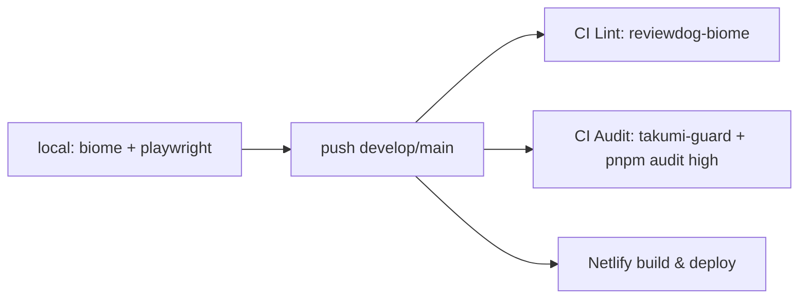

# Development Workflow

- [Daily Loop](#daily-loop)
- [Branching & Commits](#branching--commits)
- [Quality Gates](#quality-gates)
- [Release / Deploy](#release--deploy)
- [Documentation Flow](#documentation-flow)

## Daily Loop

```bash
pnpm install            # pnpm 10.33.2 (pinned via packageManager / corepack)
pnpm run dev            # Vite on http://localhost:3000 (SW enabled even in dev)
pnpm run lint[:fix]     # Biome check src/
pnpm test               # Playwright (auto-starts dev server)
pnpm run build          # Vite production build → dist/
pnpm run preview        # serve dist/ on :3000
```

No type-check script; `tsc` runs only inside editors (gap — see [todo.md](todo.md)).

## Branching & Commits

- Branches: `develop` (working), `main` (PR target/default for releases). (Factual from git state)
- Commit style: mixed — conventional-commit prefixes (`fix:`, `chore:`) and gitmoji (`:art:`) both appear in history. `.claude/rules` prescribe `<type>: <description>`.
- Local CI rehearsal: `act` via `.actrc` (Podman-configured).

## Quality Gates



Caveat: workflows have no `pull_request` trigger, and reviewdog's `github-pr-review` reporter expects one — see [known_bugs.md](known_bugs.md) #5. Tests never run in CI ([test.md](test.md)).

## Release / Deploy

- **Netlify**: builds `dist/` on push (production: fast-logbook.netlify.app). Version shown to users comes from the manifest `version` in [vite.config.js](../../vite.config.js), which must be bumped **manually together with** `package.json` (drift-prone; automation is TODO #26).
- **Docker**: optional self-hosting via `docker compose up` (port 8080).

## Documentation Flow

- Design rationale → [docs/design.md](../../docs/design.md); ADRs → [docs/ADR.md](../../docs/ADR.md); per-module specs → [docs/spec/](../../docs/spec/) (all rewritten for the React era and consistent with `src/`).
- Session history → `.claude/histories/YYYYMM.md`.
- **Warning**: `.claude/CLAUDE.md` and `.claude/rules/{code-style,security}.md` still describe the deleted vanilla-JS architecture and will mislead AI agents until rewritten ([known_bugs.md](known_bugs.md) #4).

d363d07ab70bdbae818bada7838fe13166f4ef08
