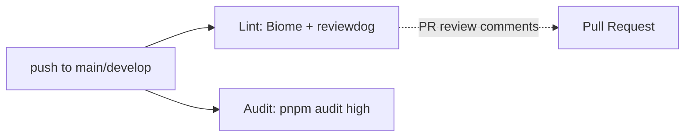

# Infrastructure

- [CI/CD (GitHub Actions)](#cicd-github-actions)
- [Hosting (Netlify)](#hosting-netlify)
- [Container (Docker / Nginx)](#container-docker--nginx)
- [Local Actions Runner](#local-actions-runner)
- [Gaps](#gaps)

## CI/CD (GitHub Actions)

Both workflows trigger on push to `main` / `develop`, run on `ubuntu-slim`, and install `flatt-security/setup-takumi-guard-npm` (npm supply-chain guard). (Factual)

| Workflow | File | Steps |
| --- | --- | --- |
| Lint | [.github/workflows/lint.yml](../../.github/workflows/lint.yml) | Biome via `mongolyy/reviewdog-action-biome` (reporter: `github-pr-review`) |
| Audit | [.github/workflows/audit.yml](../../.github/workflows/audit.yml) | pnpm 10.33.2 + Node 20 → `pnpm install --frozen-lockfile` → `pnpm audit --audit-level=high` |

**Not in CI**: Playwright E2E, TypeScript type check, production build, deploy. Deployment is Netlify-side (build on push, Speculative — standard Netlify behavior, not confirmed from repo).

## Hosting (Netlify)

[netlify.toml](../../netlify.toml): `pnpm run build` → publish `dist/`; SPA fallback redirect `/* → /index.html (200)`; `Content-Type: application/manifest+json` header for `/manifest.json`. Production URL: `https://fast-logbook.netlify.app` (from OG tags in `index.html`).

## Container (Docker / Nginx)

- [Dockerfile](../../Dockerfile): 2-stage build — `node:24.11.1-bookworm-slim` (corepack pnpm, `pnpm run build`) → `nginx:alpine` serving `dist/`. Inline Nginx conf: SPA `try_files` fallback, `no-cache` for `/` and `/sw.js`, 1-year immutable cache for static assets, `TZ=Asia/Tokyo`.
- [docker-compose.yml](../../docker-compose.yml): single service on port `8080:80`, wget healthcheck, `restart: unless-stopped`.
- Note: builder stage copies **the whole repo** into the nginx image then overlays `dist/` — source files remain served alongside build output (see [known_bugs.md](known_bugs.md)).

## Local Actions Runner

`.actrc` exists (configures `act` with macOS/Linux Podman settings — commit 38a963a). Used for running workflows locally. (Factual that the file exists; usage is by developer choice.)

## Gaps

See [todo.md](todo.md): no test workflow, no build verification in CI, no release automation.

d363d07ab70bdbae818bada7838fe13166f4ef08
