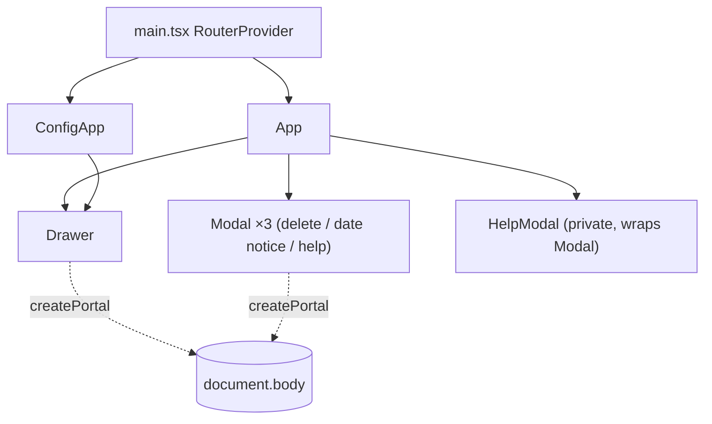

# Screens

- [Entry Point & Routing](#entry-point--routing)
- [Screen Inventory](#screen-inventory)
- [Component Hierarchy](#component-hierarchy)
- [View Conventions](#view-conventions)

## Entry Point & Routing

(Factual)

| Item | Value |
| --- | --- |
| HTML entry | [index.html](../../index.html) → `
` + `<script type="module" src="/src/main.tsx">` |
| JS entry | [src/main.tsx](../../src/main.tsx) — `createRoot` + `RouterProvider`, `StrictMode` |
| Router | `createHashRouter` (react-router-dom v7) |
| Default route | `#/` → `App` |
| Config route | `#/config` → `ConfigApp` |

Hash routing means the server only ever serves `index.html`; Netlify/Nginx SPA fallbacks are belt-and-braces.

**Inconsistency**: [tests/e2e/screenshot.spec.ts](../../tests/e2e/screenshot.spec.ts) still navigates to `/config.html` (the pre-rewrite URL), which no longer maps to the config screen. Recorded in [known_bugs.md](known_bugs.md).

## Screen Inventory

| Screen | Route | Component | Responsibilities |
| --- | --- | --- | --- |
| Main (logbook) | `#/` | [src/App.tsx](../../src/App.tsx) | Log CRUD, 9 shortcut buttons + free-text input, date selector with roll-over, formatted-log viewer (`window.open` + `document.write`), export download, delete confirm, help modal (3 tabs), PWA install prompt |
| Settings | `#/config` | [src/ConfigApp.tsx](../../src/ConfigApp.tsx) | Rounding unit select, 9 shortcut inputs, date roll-over time; live cross-tab sync via BroadcastChannel |
| Log viewer | separate window `_log_viewer` | generated HTML string ([src/lib/download.ts](../../src/lib/download.ts) `generateFormattedLog`) | HTML/plaintext/Markdown summary with copy buttons; standalone page loading Bootstrap/Font Awesome from CDN with SRI |

## Component Hierarchy

No controller/base-class inheritance (React function components only). Composition:

## View Conventions

- Shared UI primitives live in `src/components/` (`Drawer.tsx`, `Modal.tsx`), both portal-rendered Bootstrap look-alikes (offcanvas / modal) with Escape + backdrop-click close.
- Styling: Bootstrap 5 utility classes + [css/main.css](../../css/main.css); theme via `data-bs-theme` attribute, auto dark mode by `autoSetTheme()`.
- All UI strings via `useTranslation()` / `t('key')`; static help content injected with `dangerouslySetInnerHTML` from translation JSON (see [security.md](security.md)).
- `index.html` includes Speculation Rules (`prerender`/`prefetch`) — progressive enhancement, Chromium only.

d363d07ab70bdbae818bada7838fe13166f4ef08
