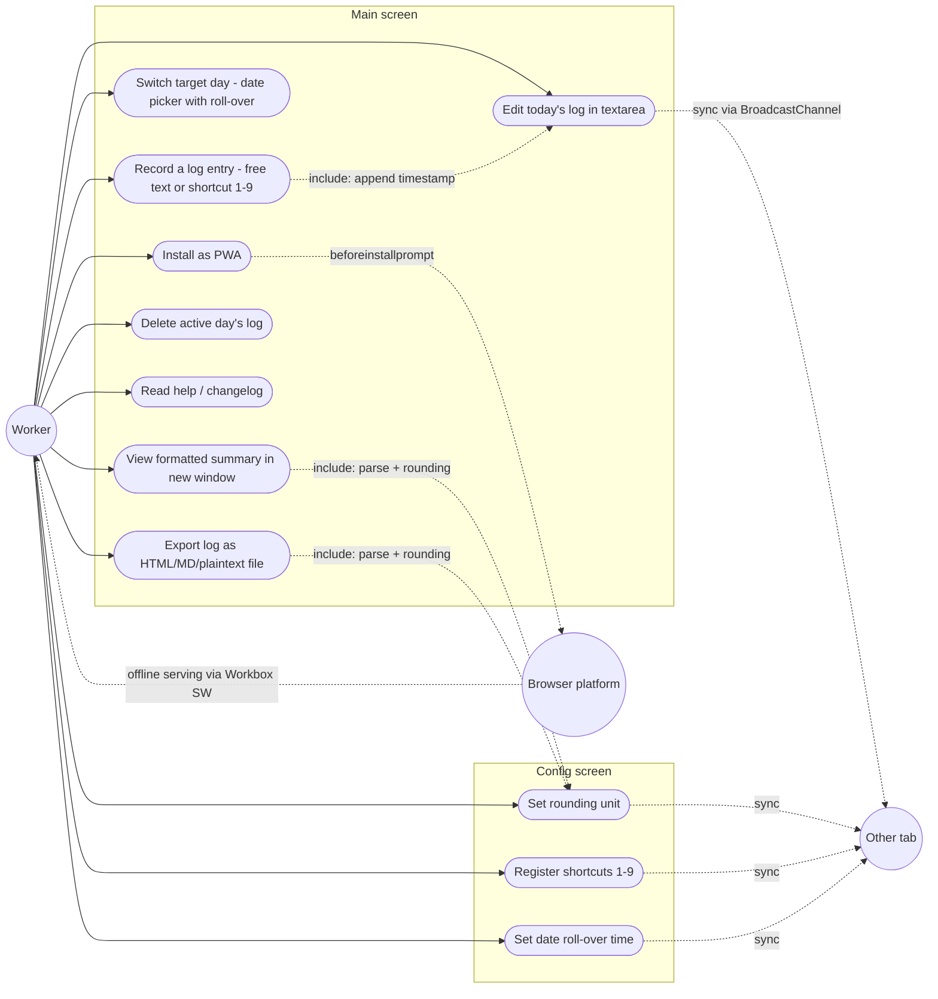

# Use Cases

- [Actors](#actors)
- [Use Case Diagram](#use-case-diagram)
- [Primary Flows](#primary-flows)

## Actors

Single human actor (**Worker** — the person logging their own time) plus two system actors: **Browser platform** (SW/PWA/IndexedDB) and **Other tab** (same user, second window). No admin, no server. (Factual)

## Use Case Diagram

Mermaid has no native use-case notation; rendered as a flowchart (ellipse = use case):

## Primary Flows

| Use case | Trigger | Outcome |
| --- | --- | --- |
| Record entry | Digit key 1–9 / shortcut button / free-text + Enter | `YYYY-MM-DD HH:MMTag` line appended, buffered, flushed to IndexedDB |
| View summary | Menu → "formatted log" | New window with per-category time table (`^` categories excluded from actual-time sum) |
| Export | Menu → download | Standalone HTML file with HTML/plaintext/Markdown sections + copy buttons |
| Day switch | Date input change | Buffer flushed, textarea reloaded with the chosen logical day |
| Delete | Menu → confirm modal | Active day's lines removed from canonical log |

d363d07ab70bdbae818bada7838fe13166f4ef08
