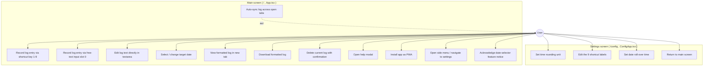

# Use Cases

## Actor

There is a single actor: **User** (the person keeping their own work log). The app has no roles, permissions, or multi-user concept — confirmed by reading `src/App.tsx` and `src/ConfigApp.tsx`, neither of which reference any user/role/auth model.

## Use case diagram

```mermaid
flowchart TB
  User((User))

  subgraph Main["Main screen ( / , App.tsx )"]
    UC1[Record log entry via shortcut key 1-9]
    UC2[Record log entry via free-text input slot 0]
    UC3[Edit log text directly in textarea]
    UC4[Select / change target date]
    UC5[View formatted log in new tab]
    UC6[Download formatted log]
    UC7[Delete current log with confirmation]
    UC8[Open help modal]
    UC9[Install app as PWA]
    UC10[Open side menu / navigate to settings]
    UC11[Acknowledge date-selector feature notice]
    UC12[Auto-sync log across open tabs]
  end

  subgraph Config["Settings screen ( /config , ConfigApp.tsx )"]
    UC13[Set time rounding unit]
    UC14[Edit the 9 shortcut labels]
    UC15[Set date roll-over time]
    UC16[Return to main screen]
  end

  User --> UC1
  User --> UC2
  User --> UC3
  User --> UC4
  User --> UC5
  User --> UC6
  User --> UC7
  User --> UC8
  User --> UC9
  User --> UC10
  User --> UC11
  User --> UC13
  User --> UC14
  User --> UC15
  User --> UC16
  UC12 -.auto.-> User
```

## Use case descriptions (trigger → outcome)

### Main screen

1. **Record log entry via shortcut key (1-9)** — User presses digit key 1-9 (or taps the corresponding on-screen button) while focus is outside a text input → the matching preset shortcut label is timestamped (`appendTime`) and appended to the log textarea, then auto-saved.
2. **Record log entry via free-text input (slot 0)** — User presses `0` (focuses the free-text field), types text, and presses Enter or blurs the field → the trimmed text is timestamped and appended to the log.
3. **Edit log text directly in textarea** — User types/edits inside the textarea → input is debounced (300ms) and saved to a `localStorage` buffer, with IME composition handled separately (`onCompositionEnd`) to avoid saving mid-composition.
4. **Select / change target date** — User changes the date `<input type="date">` (max = today) → previous edits are flushed to storage and the log view reloads filtered to the new date's window (bounded by the configured roll-over time).
5. **View formatted log** — User opens the side menu and clicks "view formatted log" → a new/reused browser tab opens synchronously (to avoid popup blockers) and is populated via `document.write()` with HTML generated by `generateFormattedLog()`, using the configured rounding unit.
6. **Download formatted log** — User clicks "download formatted log" in the side menu → `downloadLog()` is invoked with the current textarea contents, producing a downloadable file.
7. **Delete current log (with confirmation)** — User clicks "delete log" → a confirmation modal appears; confirming clears the textarea, saves, and flushes the buffer (cancel closes the modal with no change).
8. **Open help modal** — User clicks the help button in the navbar → a full-screen modal opens with tabs for "main screen," "config screen," and "changelog" help content.
9. **Install app as PWA** *(PWA-specific)* — Browser fires `beforeinstallprompt`; an "Install PWA" button appears in the side menu only then. Clicking it triggers the native install prompt (`deferredPrompt.prompt()`); the button hides again once installed or after the prompt resolves.
10. **Open side menu / navigate to settings** — User clicks the navbar toggler → a drawer opens with links/buttons for view/download/configure/delete and (conditionally) install; "configure" navigates via React Router to `/config`.
11. **Acknowledge date-selector feature notice** — On first load, if prior log data exists and the notice hasn't been dismissed before, a one-time informational modal is shown; clicking OK persists `notice_date_selector` so it won't reappear.
12. **Auto-sync log across open tabs** *(background/automatic, not directly user-triggered)* — Edits in one tab are broadcast via `BroadcastChannel('fast-logbook-sync')`; other open tabs flush and reload their log view on receiving a `LOG_DATA_KEY` or roll-over-time change message.

### Settings screen (`/config`)

13. **Set time rounding unit** — User selects a value (1/5/10/15/30/60 min) from the rounding-unit dropdown → the setting is persisted and broadcast to other open tabs.
14. **Edit the 9 shortcut labels** — User types into one of 9 shortcut text inputs (IME-composition-aware; commits on blur or non-composing change) → each shortcut string is persisted individually (`shortcut_1`..`shortcut_9`) and broadcast.
15. **Set date roll-over time** — User picks a time via the `<input type="time">` control → the roll-over time (default `05:00`) is persisted and broadcast; this changes how "today's" log boundaries are computed on the main screen.
16. **Return to main screen** — User clicks "back" in the settings side menu → navigates to `/` via React Router.

## PWA-specific vs. always-available

- **PWA-specific**: Use case 9 (Install app as PWA) — only appears/applies when the browser supports and fires the `beforeinstallprompt` event and the app is not already installed. Offline access itself (service worker registration via `navigator.serviceWorker.register('sw.js')`) is not a discrete user-triggered use case but underlies all other use cases once installed/cached — this general offline-capability claim is **Unconfirmed** here since `sw.js` itself was not inspected in this analysis (only referenced from `App.tsx`).
- **Always-available** (regardless of PWA install state, as long as the page loads in a browser): all other use cases (1-8, 10-16), since they depend only on IndexedDB/localStorage and standard browser APIs, not on installation state.

## Notes / uncertainties

- Data persistence layer (`src/lib/storage.ts`, IndexedDB + one-time localStorage migration) was referenced but not read in full during this analysis; migration behavior described (`runMigrations`) is taken directly from `App.tsx` and is accurate as of the read commit, but the underlying `getItem`/`setItem`/`migrateFromLocalStorage` implementations were not verified line-by-line.
- `generateFormattedLog()` and `downloadLog()` (in `src/lib/download.ts`) were not opened; their exact output formatting is out of scope for this use-case inventory and not claimed here beyond "produces formatted/downloadable log."
- Whether the app functions fully offline (service worker caching strategy) is **Unconfirmed** — `sw.js` was not read as part of this task.

<!-- commit-hash: ceff98ab997a60d35e564821f2e6bf7b6c284128 -->
